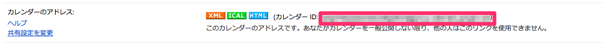

# LibraReminder

このアプリは、神戸市立図書館で借りた本の貸出期限を、googleカレンダーへ転送・更新するコマンドラインプログラムです。

## インストール方法


```ruby
gem 'libra_reminder'
```

And then execute:

    $ bundle

Or install it yourself as:

    $ gem install libra_reminder

API登録のため、下記のgemを別途インストールしてください

    $ sudo gem install google-api-client -v 0.6.4

### APIを登録

- ブラウザを起動、下記URLに移動

[https://cloud.google.com/console](https://cloud.google.com/console)

- [プロジェクトを作成]を押下


クライアントID、シークレットをメモっておく

### アクセストークンの取得

```bash
   $ google-api oauth-2-login --client-id="<your client id>" --client-secret="<your client secret>" --scope="https://www.googleapis.com/auth/calendar"
```

ブラウザが開くので、ユーザ認証（必要であれば）したのち、アプリを承認する。
なお、google-apiコマンドは、google-api-client gemの最近のバージョンには含まれないので、0.6.4を使用する。

~/.google-api.yamlが出来ているか確認する。

### 設定ファイルの編集

```bash
   $ mkdir -p ~/.libra_reminder
   $ cp $(SRC)/config-sample.yaml ~/.libra_reminder/config.yaml
```

config.yamlを編集する。

なお、`calendar_id`項目は、googleカレンダーのカレンダー設定画面から取得する。




## 使い方

```bash
		$ libra_reminder
```
を実行すると、図書館サイトから貸し出し中の書籍の名称、資料ID、貸出期限日を取得し、設定ファイルで指定したカレンダーにイベントを登録します。

本を返却したり、貸出期限を延長した場合は、このコマンドを再度実行することで、イベントを更新または削除します。


## Contributing

1. Fork it ( https://github.com/[my-github-username]/libra_reminder/fork )
2. Create your feature branch (`git checkout -b my-new-feature`)
3. Commit your changes (`git commit -am 'Add some feature'`)
4. Push to the branch (`git push origin my-new-feature`)
5. Create a new Pull Request
